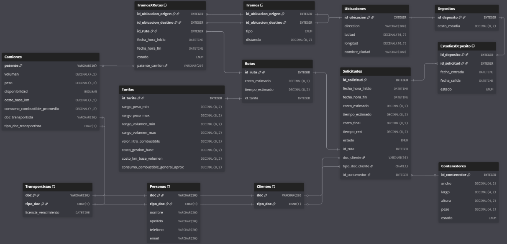

# **README – Trabajo Práctico Integrador 2025**

**Backend de Aplicaciones – Sistema de Logística de Transporte de Contenedores**

---

## 📌 **Descripción General del Sistema**

Este proyecto implementa el backend de un sistema de logística para el traslado terrestre de contenedores utilizados en construcción.
El sistema permite gestionar:

* Solicitudes de transporte
* Rutas y tramos
* Camiones y transportistas
* Depósitos y estadías
* Cálculo estimado y real de costos y tiempos
* Seguimiento del estado del contenedor en todas sus etapas

La solución está diseñada siguiendo arquitectura de **microservicios**, separación de responsabilidades y principios de **Domain-Driven Design (DDD)**.

---

# 🧩 **MICROSERVICIOS**

La arquitectura se divide en cuatro microservicios principales:

---

## **1️⃣ ServicioSolicitudes**

**Responsable de:**

* Crear solicitudes
* Asociar contenedores
* Asignar rutas a solicitudes
* Registrar costo final y tiempo real
* Proveer información para el seguimiento del envío

**Entidades:**

* Solicitudes
* Contenedores

---

## **2️⃣ ServicioRutas**

**Responsable de:**

* Consultar rutas tentativas
* Calcular tramos reales mediante OSRM
* Estimar costos y tiempos
* Registrar tramos estimados y reales
* Asignar camiones a tramos

**Entidades:**

* Rutas
* Tramos
* TramosXRutas
* Tarifas

---

## **3️⃣ ServicioDepositos**

**Responsable de:**

* Registrar depósitos y sus ubicaciones
* Gestionar estadías de contenedores
* Identificar qué contenedores se encuentran en cada depósito

**Entidades:**

* Ubicaciones
* Depositos
* EstadiasDeposito

---

## **4️⃣ ServicioPersonas**

**Responsable de:**

* Registrar clientes y transportistas
* Gestionar camiones y su disponibilidad
* Validar capacidad de carga por peso y volumen

**Entidades:**

* Personas
* Clientes
* Transportistas
* Camiones

---

# 🗄️ **DIAGRAMA ENTIDAD–RELACIÓN**



---

# 🔐 **Seguridad**

La aplicación utiliza:

* **Keycloak** como proveedor de identidad
* **Tokens JWT** para asegurar cada endpoint
* **Roles principales:** Cliente, Operador y Transportista

Cada microservicio valida los permisos según el rol del usuario autenticado.

---

# 🌐 **Integración Externa**

El sistema se integra con **OSRM (Open Source Routing Machine)** para obtener:

* Distancias entre puntos
* Información geográfica real de tramos
* Tiempo estimado del recorrido

---

# 🏗️ **Tecnologías Utilizadas**

* Java 17
* Spring Boot
* Spring Security
* Spring Data JPA
* Docker / Docker Compose
* Keycloak
* PostgreSQL

---

# 📂 **Estructura del Proyecto**

Cada microservicio sigue la arquitectura:

```
controller/
service/
    interfaces/
    impl/
repository/
client/
config/
model/
```

---

# 🧠 **Notas Finales**

La solución se diseñó respetando:

* Cohesión alta en cada microservicio
* Bajo acoplamiento entre contextos
* Trazabilidad del contenedor durante todo el proceso
* Correcto manejo de estados y registros temporales
* Cumplimiento estricto del enunciado del TPI 2025

---

# 📝 **Comentarios Generales del Modelo**

* **Cada contenedor puede tener únicamente una solicitud activa.**

* **Cada solicitud tiene asignada exactamente una ruta.**
  Una vez elegida la ruta definitiva, queda vinculada a esa solicitud.

* **Cada ruta pertenece únicamente a una solicitud.**
  No se reutilizan rutas entre solicitudes.

* **Si un cliente desea transportar varios contenedores**,
  deberá generar **una solicitud por contenedor**, incluso si todos realizan el mismo recorrido.
  Cada solicitud tendrá su propia ruta independiente.
