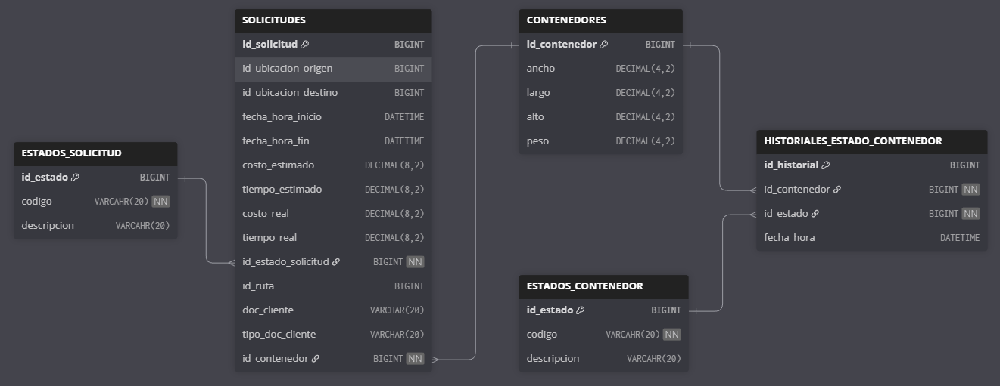
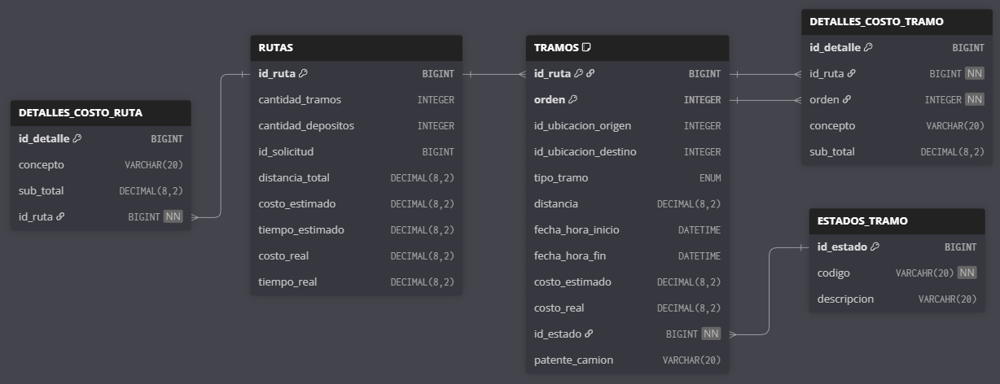
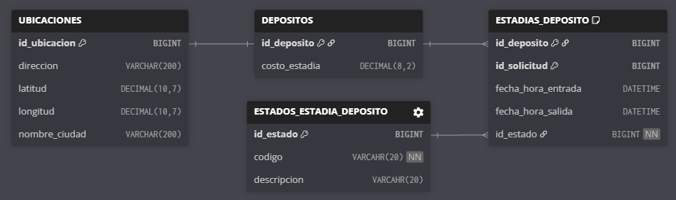
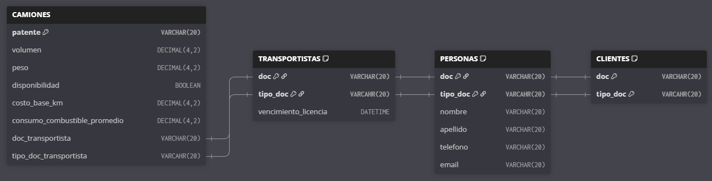
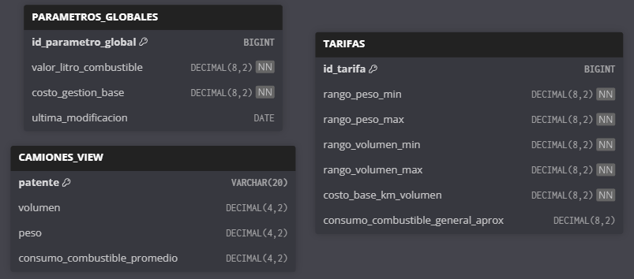

# **README – Trabajo Práctico Integrador 2025**

**Sistema de Logística de Transporte de Contenedores**

Universidad Tecnológica Nacional - Facultad Regional de Córdoba

Cátedra: Backend de Aplicaciones

Jefe de Cátedra: Felipe Steffolani

---

## 📌 **Descripción General del Sistema**

Este proyecto corresponde a un Trabajo Práctico Integrador, cuyo objetivo es diseñar e implementar un sistema backend basado en microservicios que modele un escenario realista de gestión de transporte de carga.

El sistema aborda el ciclo completo del negocio, incluyendo la creación de solicitudes de transporte, la asignación de rutas y camiones, la gestión de tramos, el cálculo de tarifas y el seguimiento de estados, aplicando criterios de separación de responsabilidades y comunicación entre servicios.

La solución está implementada utilizando Spring Boot y una arquitectura de microservicios que incluye API Gateway, Service Discovery, comunicación asincrónica mediante eventos, bases de datos independientes por servicio, cálculo de rutas mediante OSRM y autenticación centralizada con Keycloak. El despliegue completo se realiza mediante Docker, permitiendo levantar el entorno de forma reproducible y sin configuraciones manuales complejas.

El proyecto incluye datos precargados, documentación de la API mediante Swagger y flujos de prueba a través de una colección de Postman.

> 📄 El enunciado completo del trabajo práctico y la coleccion de Postman se encuentran disponibles en la carpeta docs/

---

# 🧩 **MICROSERVICIOS**

La arquitectura se divide en cinco microservicios principales:

---

## **1️⃣ ServicioSolicitudes**

**Responsable de:**

* Crear solicitudes
* Asociar contenedores
* Asignar rutas a solicitudes
* Registrar costo final y tiempo real
* Proveer información para el seguimiento del envío

**Diagrama Entidad-Relación:**


---

## **2️⃣ ServicioRutas**

**Responsable de:**

* Consultar rutas tentativas
* Calcular tramos reales mediante OSRM
* Estimar costos y tiempos
* Registrar tramos estimados y reales
* Asignar camiones a tramos
* Iniciar y finalizar tramos
* Calcular detalle de costos

**Diagrama Entidad-Relación:**


---

## **3️⃣ ServicioDepositos**

**Responsable de:**

* Registrar depósitos y ubicaciones
* Gestionar estadías de contenedores
* Identificar qué contenedores se encuentran en cada depósito

**Diagrama Entidad-Relación:**


---

## **4️⃣ ServicioPersonas**

**Responsable de:**

* Registrar clientes y transportistas
* Gestionar camiones y su disponibilidad

**Diagrama Entidad-Relación:**


---

## **5️⃣ ServicioTarifas**

**Responsable de:**

* Gestionar tarifas
* Proveer parametros globales para el cálculo de costos de gestión

**Diagrama Entidad-Relación:**


> CAMIONES_VIEW corresponde a una vista utilizada para el cálculo de tarifas, derivada de información del ServicioPersonas.
---

# 🔐 **Seguridad**

La aplicación utiliza:

* **Keycloak** como proveedor de identidad
* **Tokens JWT** para asegurar cada endpoint
* **Roles principales:** Cliente, Operador y Transportista

Cada microservicio valida JWT de forma independiente siguiendo el principio Zero Trust.

---

# 🌐 **Integración Externa**

El sistema se integra con **OSRM (Open Source Routing Machine)** para obtener:

* Distancias entre puntos
* Información geográfica real de tramos
* Tiempo estimado del recorrido

---

# 🏗️ **Tecnologías Utilizadas**

* Java 17
* Spring Boot
* Spring Security
* Spring Data JPA
* Docker / Docker Compose
* Keycloak
* PostgreSQL
* Eureka
* OSRM
* Kafka
* MapStruct

---

# 📂 **Estructura del Proyecto**

Cada microservicio sigue la arquitectura:

```
controller/
service/
    interfaces/
    impl/
repository/
client/
config/
model/
dto/
mapper/
workflow/
exception/
```

### 🔌 Comunicación por Eventos (Kafka)

Algunos microservicios incorporan componentes adicionales para la comunicación asincrónica mediante eventos:

- **ServicioPersonas**
  - `infrastructure/messaging/`: productores de eventos
  - `event/`: definición de eventos de dominio publicados

- **ServicioTarifas**
  - `listener/`: consumidores de eventos
  - `event/`: definición de eventos de dominio recibidos

---

## 🚀 Cómo levantar el proyecto

El proyecto se encuentra completamente **dockerizado**, por lo que no requiere configuraciones manuales adicionales para su ejecución básica.

### 🔧 Requisitos previos

* Docker
* Docker Compose

---

### ▶️ Ejecución

Desde la raíz del proyecto, ejecutar:

```bash
docker compose up --build
```

Esto levantará:

* API Gateway
* Eureka Server
* Microservicios del dominio
* Bases de datos PostgreSQL por microservicio
* Keycloak para autenticación
* Kafka para mensajería asincrónica

> El proyecto incluye **Keycloak configurado en Docker** para la gestión de autenticación y autorización. La configuración necesaria (realm, clientes y roles) se encuentra preparada para el entorno de desarrollo.

---

## 🗺️ OSRM (opcional)
El sistema puede ejecutarse sin OSRM.
Solo es necesario si se desea calcular nuevas rutas.

### Instalación opcional
```bash
chmod +x scripts/*.sh
./scripts/osrm-generate.sh
docker compose --profile osrm up -d
```

⏱️ Tiempo estimado: 40 - 50 minutos
💾 Espacio requerido: ~3 GB

---

## 📬 Colección de Postman

La coleccion de Postman incluye los **endpoints más relevantes del sistema**, orientada a demostrar el **flujo principal del negocio (Happy Path)** y las operaciones de seguimiento.

Dado que cada operación requiere un rol distinto, es necesario **obtener un token de acceso antes de cada llamada**, utilizando el usuario correspondiente.

Para facilitar la prueba del sistema, se encuentran usuarios de ejemplo precargados, cuyas credenciales coinciden con su rol:

* Cliente

  * Usuario: cliente

  * Contraseña: cliente

* Operador

  * Usuario: operador

  * Contraseña: operador

* Transportista

  * Usuario: transportista

  * Contraseña: transportista

---

### 🔁 Endpoints incluidos en la colección

| Método | Endpoint                                           | Descripción                                                   | Rol Autorizado | Datos de Entrada                                            | Respuesta                                      |
| ------ | -------------------------------------------------- | ------------------------------------------------------------- | -------------- | ----------------------------------------------------------- | ---------------------------------------------- |
| POST   | `/api/solicitudes`                                 | Crea una nueva solicitud de transporte                        | Cliente        | Ubicacion de Origen, Ubicacion de Destino, Datos del Contenedor y Datos del Cliente | 201 Created |
| GET    | `/api/rutas/tentativas`                            | Consulta rutas tentativas y estimaciones utilizando OSRM      | Operador       | Coordenadas de origen y destino y costos tarifarios         | 200 OK + Lista de rutas con distancia y tiempo estimado |
| POST   | `/api/rutas`                                       | Asigna una ruta seleccionada a una solicitud                  | Operador       | Identificador de solicitud y ruta                           | 201 Created              |
| PATCH  | `/api/tramos/{idRuta}/{ordenTramo}/asignar-camion` | Asigna un camión a un tramo específico                        | Operador       | Datos del Camion y del Contenedor                           | 204 No Content              |
| PATCH  | `/api/tramos/{idRuta}/{ordenTramo}/iniciar`        | Inicia la ejecución de un tramo                               | Transportista  | —                                                           | 204 No Content              |
| PATCH  | `/api/tramos/{idRuta}/{ordenTramo}/finalizar`      | Finaliza la ejecución de un tramo                             | Transportista  | —                                                           | 204 No Content              |
| GET    | `/api/contenedores/{idContenedor}/estados`         | Consulta el seguimiento y estados históricos de un contenedor | Cliente        | —                                                           | 200 OK + Historial de estados              |
| GET    | `/api/solicitudes/{idSolicitud}`                   | Consulta la información de una Solicitud                      | Cliente y Operador | —                                                           | 200 OK + Solicitud              |
| GET    | `/api/rutas/{idRuta}`                              | Consulta la información de una Ruta                           | Cliente y Operador | —                                                           | 200 OK + Ruta              |
| GET    | `/api/rutas/{idRuta}/costos`                       | Consulta el detalle de los costos de una Ruta y sus Tramos    | Cliente        | —                                                           | 200 OK + Detalle de costos               |

---

> La documentación completa de la API, incluyendo todos los endpoints disponibles, se encuentra accesible mediante **Swagger**.

---

# 🧠 **Notas Finales**

La solución se diseñó respetando:

* Cohesión alta en cada microservicio
* Bajo acoplamiento entre contextos
* Trazabilidad del contenedor durante todo el proceso
* Correcto manejo de estados y registros temporales
* Cumplimiento estricto del enunciado del TPI 2025

---

# 👨‍💻 Autor
Ayrton Vanega